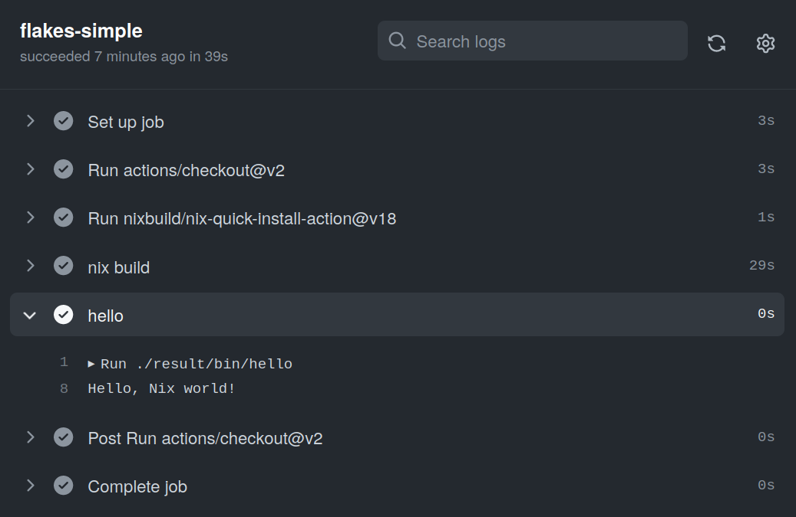

# Nix Quick Install Action

This GitHub Action installs [Nix](https://nixos.org/nix/) in single-user mode,
and adds almost no time at all to your workflow's running time.

The Nix installation is deterministic &ndash; for a given
release of this action the resulting Nix setup will always be identical, no
matter when you run the action.

* Supports all Linux and MacOS runners

* Single-user installation (no `nix-daemon`)

* Installs in &asymp; 1 second on Linux, &asymp; 5 seconds on MacOS

* Allows selecting Nix version via the `nix_version` input

* Allows specifying `nix.conf` contents via the `nix_conf` input

## Details

The main motivation behind this action is to install Nix as quickly as possible
in your GitHub workflow. If that isn't important, you should probably use the
[Install Nix](https://github.com/marketplace/actions/install-nix) action
instead, which sets up Nix in multi-user mode (daemon mode) using the official
Nix installer.

To make this action as quick as possible, the installation is minimal: no
nix-daemon, no nix channels and no `NIX_PATH`. The nix store (`/nix/store`) is
owned by the unprivileged runner user.

The action provides you with a fully working Nix setup, but since no `NIX_PATH`
or channels are setup you need to handle this on your own. Nix Flakes is great
for this, and works perfectly with this action (see below).
[niv](https://github.com/nmattia/niv) should also work fine, but has not been
tested yet.

## Inputs

See [action.yml](action.yml) for documentation of the available inputs.
The available Nix versions are listed in the [release
notes](https://github.com/nixbuild/nix-quick-install-action/releases/latest).

## Usage

### Minimal example

The following workflow installs Nix and then just runs
`nix-build --version`:

```yaml
name: Examples
on: push
jobs:
  minimal:
    runs-on: ubuntu-latest
    steps:
      - uses: nixbuild/nix-quick-install-action@v24
      - run: nix build --version
      - run: nix build ./examples/flakes-simple
      - name: hello
        run: ./result/bin/hello
```


### Flakes

For `nix` > `2.13`, these settings are always set by default:

```conf
experimental-features = nix-command flakes
accept-flake-config = true
```

This variant will also automatically set up the environment to bridge the
configuration from the `nixConfig` flake attribute for old-style (`nix-build`,
`nix-store` etc) Nix commands.

To disable that convenience bridge, you can specify:

```yaml
name: Examples
on: push
jobs:
  flakes-simple:
    runs-on: ubuntu-latest
    steps:
      - uses: actions/checkout@v3
      - uses: nixbuild/nix-quick-install-action@v24
        with: {load_nixConfig: false}
```



You can see the flake definition for the above example in
[examples/flakes-simple/flake.nix](examples/flakes-simple/flake.nix).

### Using Cachix

You can use the [Cachix action](https://github.com/marketplace/actions/cachix)
together with this action, just make sure you put it after this action in your
workflow.

### Using specific Nix versions locally

Locally, you can use this repository's Nix flake to build or run any of the
versions of Nix that this action supports. This is very convenient if you
quickly need to compare the behavior between different Nix versions.

Build a specific version of Nix like this (requires you to use a version of Nix
that supports flakes):

```
$ nix build github:nixbuild/nix-quick-install-action#nix-2_3_16

$ ./result/bin/nix --version
nix (Nix) 2.3.16
```

With `nix shell -c` you can also directly run Nix like this:

```
$ nix shell github:nixbuild/nix-quick-install-action#nix-2_2_2 -c nix --version
nix (Nix) 2.2.2
```

List all available Nix versions like this:

```
$ nix flake show github:nixbuild/nix-quick-install-action
github:nixbuild/nix-quick-install-action/10392fafadd0d126bf44633d015661e818ea39e2
├───apps
│   ├───x86_64-darwin
│   │   └───release: app
│   └───x86_64-linux
│       └───release: app
├───defaultApp
│   ├───x86_64-darwin: app
│   └───x86_64-linux: app
├───overlays
│   ├───x86_64-darwin: Nixpkgs overlay
│   └───x86_64-linux: Nixpkgs overlay
└───packages
    ├───x86_64-darwin
    │   ├───nix-2_10_3: package 'nix-2.10.3'
    │   ├───nix-2_11_1: package 'nix-2.11.1'
    │   ├───nix-2_12_1: package 'nix-2.12.1'
    │   ├───nix-2_13_3: package 'nix-2.13.3'
    │   ├───nix-2_14_1: package 'nix-2.14.1'
    │   ├───nix-2_15_1: package 'nix-2.15.1'
    │   ├───nix-2_16_1: package 'nix-2.16.1'
    │   ├───nix-2_1_3: package 'nix-2.1.3'
    │   ├───nix-2_2_2: package 'nix-2.2.2'
    │   ├───nix-2_3_16: package 'nix-2.3.16'
    │   ├───nix-2_4: package 'nix-2.4'
    │   ├───nix-2_5_1: package 'nix-2.5.1'
    │   ├───nix-2_6_1: package 'nix-2.6.1'
    │   ├───nix-2_7_0: package 'nix-2.7.0'
    │   ├───nix-2_8_1: package 'nix-2.8.1'
    │   ├───nix-2_9_2: package 'nix-2.9.2'
    │   ├───nix-archives: package 'nix-archives'
    │   └───release: package 'release'
    └───x86_64-linux
        ├───nix-2_0_4: package 'nix-2.0.4'
        ├───nix-2_10_3: package 'nix-2.10.3'
        ├───nix-2_11_1: package 'nix-2.11.1'
        ├───nix-2_12_1: package 'nix-2.12.1'
        ├───nix-2_13_3: package 'nix-2.13.3'
        ├───nix-2_14_1: package 'nix-2.14.1'
        ├───nix-2_15_1: package 'nix-2.15.1'
        ├───nix-2_16_1: package 'nix-2.16.1'
        ├───nix-2_1_3: package 'nix-2.1.3'
        ├───nix-2_2_2: package 'nix-2.2.2'
        ├───nix-2_3_16: package 'nix-2.3.16'
        ├───nix-2_4: package 'nix-2.4'
        ├───nix-2_5_1: package 'nix-2.5.1'
        ├───nix-2_6_1: package 'nix-2.6.1'
        ├───nix-2_7_0: package 'nix-2.7.0'
        ├───nix-2_8_1: package 'nix-2.8.1'
        ├───nix-2_9_2: package 'nix-2.9.2'
        ├───nix-archives: package 'nix-archives'
        └───release: package 'release'
```

If you want to make sure that the version of Nix you're trying to build hasn't
been removed in the latest revision of `nix-quick-install-action`, you can
specify a specific release of `nix-quick-install-action` like this:

```
$ nix build github:nixbuild/nix-quick-install-action/v12#nix-2_3_7
```

Note that we've added `/v12` to the flake url above.
